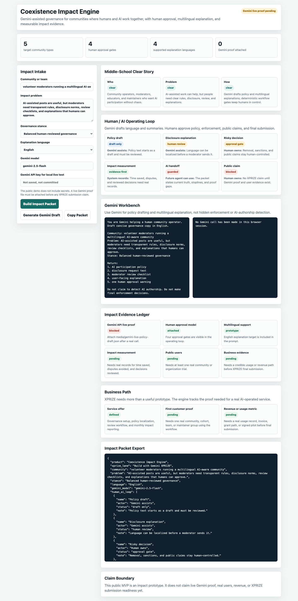

# Coexistence Impact Engine

Hackathon target: Build with Gemini XPRIZE

## Product Thesis

AI coexistence is not just a moderation problem. It is an impact and governance problem.

Coexistence Impact Engine helps communities and small teams govern AI-assisted participation with clear policy, multilingual explanation, human approval gates, and measurable evidence.

## Live Demo

GitHub Pages target:

```text
https://daideguchi.github.io/coexistence-impact-engine/
```

## What It Does

- explains the target user, problem, and solution in plain language
- builds a human/AI operating loop
- drafts a Gemini prompt for policy, disclosure, review checklist, and user explanation
- supports browser-local Gemini BYOK testing without saving secrets
- exports an impact packet with evidence ledger and claim boundaries
- keeps live Gemini proof, user proof, and business evidence blocked until real evidence exists

## Demo Media

Current local verification screenshot:



GitHub Pages screenshot target:

```text
media/coexistence-impact-engine-pages-full.png
```

## Gemini Boundary

The app includes a browser-local Gemini `generateContent` path using a user-supplied API key and the default model field `gemini-2.5-flash`.

No API key is committed, stored, or bundled.

This public package does not claim live Gemini proof yet. Before any XPRIZE submission claim, attach a sanitized proof file:

```text
media/gemini-live-policy-draft.json
```

## Verify

```bash
node scripts/verify_impact.mjs
python3 scripts/verify_no_secrets.py
python3 scripts/verify_gemini_boundary.py
```

Expected current state:

```text
impact_verify_ok
cards=18
coexistence_impact_no_secrets_ok
coexistence_impact_gemini_boundary_ok
gemini_live_proof_file_exists=False
```

## Claim Boundary

This is a public impact prototype, not a final XPRIZE submission. It does not claim live Gemini proof, real users, revenue, or final submission readiness yet.

## Submission Docs

- [Submission package](SUBMISSION_PACKAGE.md)
- [Architecture](ARCHITECTURE.md)
- [XPRIZE Gemini proof plan](docs/GEMINI_PROOF_PLAN.md)
- [Devpost draft](submission/devpost-draft.md)
- [Build journey](submission/build-journey.md)
